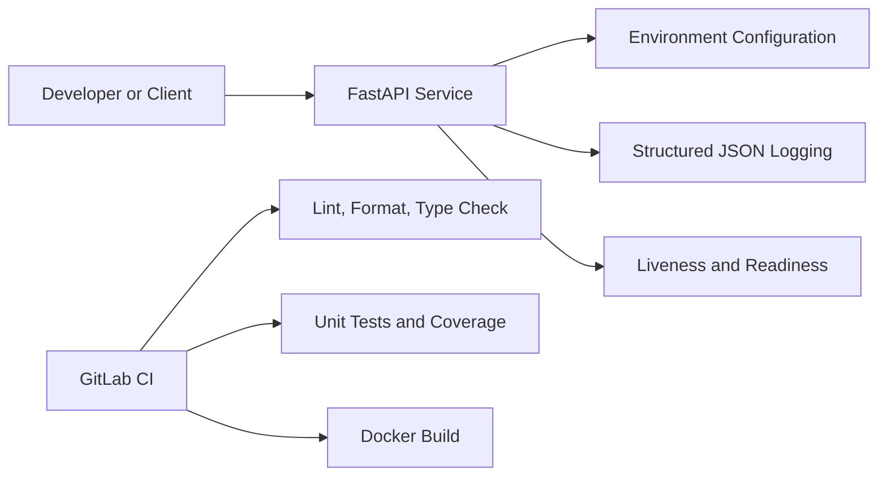

# Platform Overview

## Purpose

The Enterprise AI Platform is a reference implementation for reusable enterprise agent capabilities. Week 1 establishes a dependable engineering baseline before MCP, tools, agents, RAG, evaluation, and observability are added.

## Sprint 1 logical architecture

## Design principles

1. Configuration is externalized through environment variables.
2. Logs are machine-readable and suitable for future centralized observability.
3. Health endpoints support container orchestration.
4. Static analysis and automated tests are mandatory before merging.
5. The service runs as a non-root container user.
6. Sprint 1 contains no LLM, MCP, database, or Seagate production integration.

## Runtime flow

1. Uvicorn starts the FastAPI process.
2. Settings are loaded from environment variables or `.env` locally.
3. Structured logging is configured.
4. Startup metadata is emitted.
5. Clients call the root or health endpoints.
6. Kubernetes-compatible health probes can check service status.
