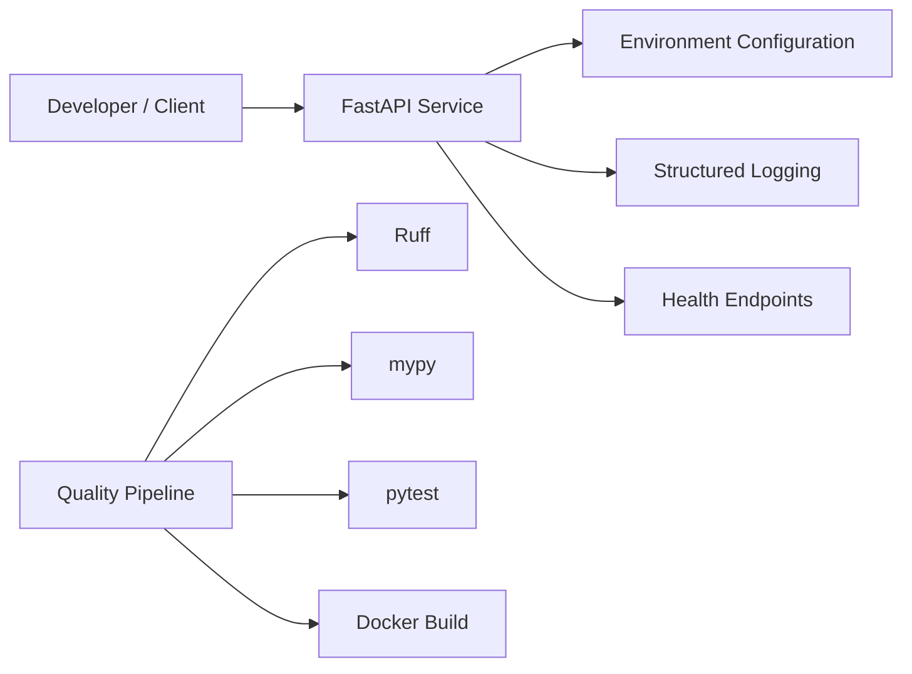

# Platform Overview

## Purpose

The Enterprise AI Platform is a public reference implementation demonstrating how to build production-oriented Enterprise AI systems using modern software engineering practices.

This document describes the **platform foundation** established during **Sprint 1**. It defines the engineering baseline that all subsequent platform capabilities build upon.

Later architecture documents extend this baseline:

- Sprint 2 – Enterprise MCP Framework
- Sprint 3 – Agent Runtime
- Sprint 4 – Memory & Context
- Sprint 5 – Evaluation Framework
- Sprint 6 – Observability
- Sprint 7 – Production Platform
- Sprint 8 – Enterprise AI Platform

---

# Platform Foundation Architecture



---

# Scope

Sprint 1 establishes the engineering foundation for the platform.

Included:

- FastAPI application
- Environment configuration
- Structured logging
- Health endpoints
- Docker support
- Automated testing
- Static analysis
- Release workflow

Not included:

- MCP
- Tool Registry
- Agent Runtime
- Memory
- Evaluation
- Observability
- Production integrations

---

# Design Principles

The platform follows several engineering principles.

## Configuration First

Configuration is externalized through environment variables.

## Strong Typing

All production code must pass strict static type checking.

## Quality Gates

Every change passes:

- Ruff
- mypy
- pytest

before merging.

## Observability Ready

Structured logging forms the basis for future tracing and monitoring.

## Layered Architecture

Framework code remains separate from future platform services.

## Production-Oriented

The platform is designed to evolve into a reusable enterprise AI platform rather than a demonstration application.

---

# Runtime Flow

```text
Developer

↓

FastAPI Startup

↓

Load Configuration

↓

Configure Logging

↓

Expose Health Endpoints

↓

Serve HTTP Requests
```

---

# Deliverables

Sprint 1 produced:

- FastAPI platform
- Docker support
- Structured logging
- OpenAPI
- Ruff
- mypy
- pytest
- Pull Request workflow
- Release tagging

Release:

**v0.1.0-foundation**

---

# Related Documents

Architecture:

- 02-mcp-tool-platform.md

Architecture Decision Records:

- ADR-001 Python + FastAPI
- ADR-002 Structured Logging
- ADR-003 MCP as Transport Adapter
- ADR-004 In-Memory Tool Registry
- ADR-005 Pydantic Tool Contracts
- ADR-006 Async Tool Execution