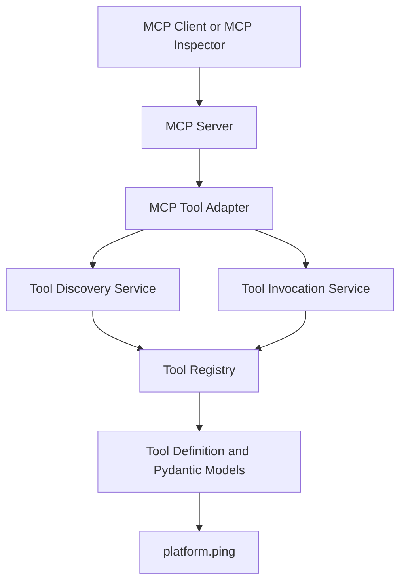
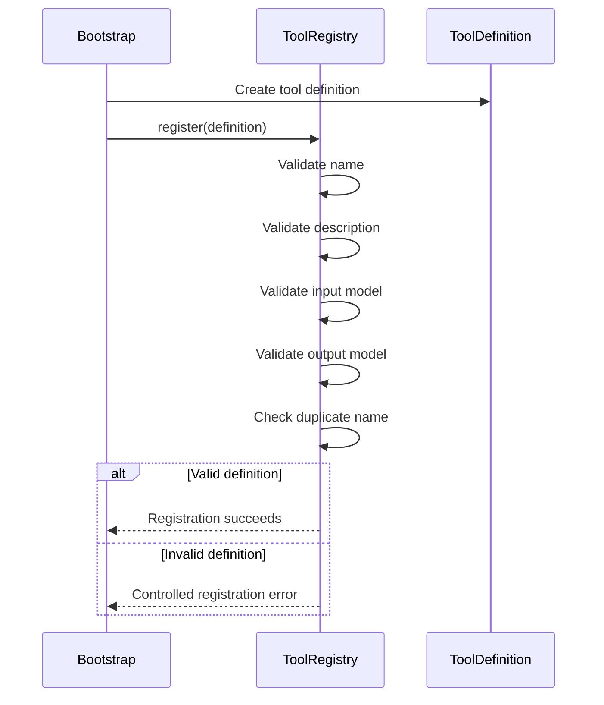
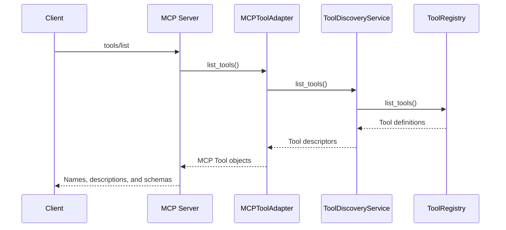
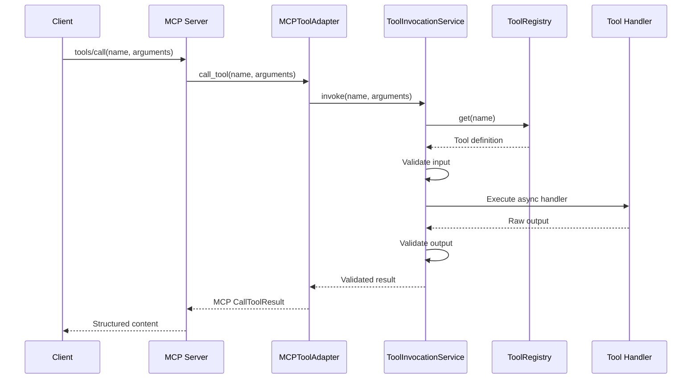

# MCP Tool Platform Architecture

## Purpose

This document describes the implemented architecture of the Enterprise AI Platform MCP tool layer delivered in Sprint 2.

The Sprint 2 architecture provides a reusable, protocol-independent enterprise tool platform that exposes validated tools through the Model Context Protocol (MCP) without coupling the core tool runtime to MCP itself.

The implementation supports:

- Tool registration
- Tool discovery
- Tool invocation
- Typed input and output contracts
- JSON Schema generation
- Runtime validation
- Consistent error handling
- MCP-based discovery and invocation
- Automated testing
- Local validation with MCP Inspector

This document reflects the code currently implemented in the repository and is the authoritative architecture reference for Sprint 2.

---

## Scope

### Included

- In-memory enterprise tool registry
- Immutable tool definitions
- Pydantic-based input and output contracts
- JSON Schema generation
- Protocol-independent discovery service
- Protocol-independent invocation service
- Built-in `platform.ping` tool
- MCP adapter
- MCP stdio server
- MCP Inspector validation
- Unit and adapter tests

### Excluded

The following capabilities are intentionally deferred:

- Agent runtime
- Planning engine
- Conversation memory
- Persistent tool registry
- Authentication and authorization
- Tool-level policy enforcement
- Human approval workflows
- Correlation IDs and distributed tracing
- Timeouts, retries, and cancellation
- Database-backed enterprise tools
- Evaluation framework
- Production observability
- Kubernetes deployment

---

## Architecture Principles

1. **MCP is a transport adapter**  
   The tool platform does not depend on MCP types or MCP sessions. MCP translates protocol requests into internal discovery and invocation operations.

2. **Contracts are defined before orchestration**  
   Every tool declares typed input and output models before it can be registered or invoked.

3. **Pydantic is the source of truth**  
   Runtime validation and advertised JSON Schema are generated from the same models.

4. **Tools remain independently testable**  
   Tool handlers can be tested and invoked without running an MCP server.

5. **Registration fails fast**  
   Invalid tool names, empty descriptions, duplicate names, and invalid model types are rejected at registration time.

6. **Invocation is centrally controlled**  
   Tool lookup, input validation, execution, output validation, and exception normalization are performed by one invocation service.

7. **The implementation is intentionally minimal**  
   Sprint 2 establishes a clean foundation without prematurely adding persistence, security, policy, or agent orchestration.

---

## Logical Architecture



---

## Component Responsibilities

| Component | Responsibility |
|---|---|
| `ToolDefinition` | Defines the tool name, description, input model, output model, and async handler. |
| `ToolRegistry` | Registers, validates, stores, lists, and resolves tool definitions. |
| `ToolDiscoveryService` | Projects internal tool definitions into safe discovery descriptors without exposing handlers. |
| `ToolInvocationService` | Resolves tools, validates input, executes handlers, validates output, and normalizes errors. |
| `platform.ping` | Provides the first deterministic built-in tool used for validation and connectivity testing. |
| `MCPToolAdapter` | Converts internal discovery and invocation results into MCP types. |
| MCP server | Exposes `tools/list` and `tools/call` over stdio transport. |

---

## Package Structure

```text
apps/api/src/enterprise_ai_api/
├── mcp/
│   ├── __init__.py
│   ├── adapter.py
│   └── server.py
│
└── tools/
    ├── __init__.py
    ├── contracts.py
    ├── discovery.py
    ├── exceptions.py
    ├── invocation.py
    ├── registry.py
    └── builtins/
        ├── __init__.py
        └── ping.py
```

Tests:

```text
apps/api/tests/
├── test_mcp_adapter.py
└── tools/
    ├── __init__.py
    ├── test_contracts.py
    ├── test_discovery.py
    ├── test_invocation.py
    ├── test_ping.py
    └── test_registry.py
```

---

## Tool Contract Model

Each tool is represented by an immutable `ToolDefinition`.

```python
@dataclass(frozen=True, slots=True)
class ToolDefinition:
    name: str
    description: str
    input_model: type[BaseModel]
    output_model: type[BaseModel]
    handler: ToolHandler
```

The handler contract is asynchronous:

```python
ToolHandler = Callable[[BaseModel], Awaitable[BaseModel]]
```

This gives every tool:

- A stable name
- A human-readable description
- A typed input contract
- A typed output contract
- A single async execution entry point
- Generated JSON Schema for discovery

---

## Tool Naming Convention

Tools use a lowercase namespace and tool name:

```text
namespace.tool_name
```

Examples:

```text
platform.ping
inventory.get_stock
planning.get_demand
procurement.get_purchase_order
```

The registry rejects invalid names such as:

```text
ping
Platform.Ping
platform-ping
platform.
```

---

## Tool Registration Flow



Registration rules:

- Tool name must match the naming convention.
- Description must not be empty.
- Input model must inherit from `pydantic.BaseModel`.
- Output model must inherit from `pydantic.BaseModel`.
- Duplicate tool names are rejected.
- Registered tools are returned in deterministic name order.

---

## Tool Discovery Flow



Discovery exposes:

- Tool name
- Tool description
- Input JSON Schema
- Output JSON Schema

Discovery does not expose:

- Handler objects
- Internal registry storage
- Runtime implementation details

---

## Tool Invocation Flow



The invocation service:

1. Resolves the tool by name.
2. Validates arguments against the input model.
3. Executes the async handler.
4. Normalizes unexpected execution failures.
5. Validates the handler output against the output model.
6. Returns a dictionary created from the validated output model.

Invalid input never reaches the handler, and invalid output never escapes the tool boundary.

---

## JSON Schema Contracts

Pydantic models are the authoritative source for tool contracts.

```python
class PingInput(BaseModel):
    model_config = ConfigDict(extra="forbid")

    message: str = Field(
        default="ping",
        min_length=1,
        max_length=100,
    )
```

JSON Schema is generated through:

```python
PingInput.model_json_schema()
```

This provides:

- One source of truth
- Runtime validation
- MCP-compatible JSON Schema
- Reduced schema drift
- Clear client-side contracts

The platform does not maintain separate handwritten JSON Schema for built-in tools.

---

## Built-in `platform.ping` Tool

The first built-in tool validates the complete flow from registration through MCP invocation.

### Input

```json
{
  "message": "Sprint 2 MCP validation"
}
```

### Output

```json
{
  "message": "Sprint 2 MCP validation",
  "response": "pong",
  "service": "enterprise-ai-platform",
  "version": "0.2.0"
}
```

The tool is deterministic and does not access external systems.

It verifies:

- Registry registration
- Tool discovery
- Input validation
- Handler execution
- Output validation
- MCP conversion
- MCP Inspector compatibility

---

## Error Handling

| Error | Meaning |
|---|---|
| `ToolPlatformError` | Base error for the tool platform. |
| `InvalidToolDefinitionError` | A tool definition violates registry requirements. |
| `ToolAlreadyRegisteredError` | A duplicate name is registered. |
| `ToolNotFoundError` | A requested tool does not exist. |
| `ToolInputValidationError` | Input does not satisfy the declared contract. |
| `ToolOutputValidationError` | Handler output does not satisfy the declared contract. |
| `ToolExecutionError` | A handler fails unexpectedly. |

The MCP adapter maps internal failures to stable external codes:

| Internal condition | MCP error code |
|---|---|
| Tool not found | `TOOL_NOT_FOUND` |
| Input invalid | `TOOL_INPUT_INVALID` |
| Output invalid | `TOOL_OUTPUT_INVALID` |
| Execution failed | `TOOL_EXECUTION_FAILED` |

Example:

```json
{
  "error": {
    "code": "TOOL_INPUT_INVALID",
    "message": "Input validation failed for tool 'platform.ping'."
  }
}
```

Internal stack traces are not returned to MCP clients.

---

## MCP Adapter Boundary

The MCP layer depends on the internal tool platform.

The internal tool platform does not depend on MCP.

Correct dependency direction:

```text
MCP Server
    ↓
MCP Adapter
    ↓
Discovery and Invocation Services
    ↓
Tool Registry
    ↓
Tool Contracts and Handlers
```

This enables future reuse by:

- Agent Runtime
- REST APIs
- Command-line clients
- Evaluation runners
- Scheduled jobs
- Integration tests
- Other protocol adapters

---

## MCP Server

The MCP server:

- Uses the official Python MCP SDK
- Uses stdio transport
- Registers `tools/list`
- Registers `tools/call`
- Builds capabilities during initialization
- Uses the internal adapter for all discovery and invocation

Development entry point:

```bash
python -m enterprise_ai_api.mcp.server
```

Installed console entry point:

```bash
enterprise-ai-mcp
```

The stdio server must not write ordinary application output to stdout because stdout is reserved for MCP protocol messages.

---

## Validation with MCP Inspector

Sprint 2 validation confirmed:

- Server initialization
- Server name and version
- `tools/list`
- Discovery of `platform.ping`
- Input schema display
- Output schema display
- `tools/call`
- Structured result
- Output-schema compliance

Example invocation:

```json
{
  "message": "Sprint 2 MCP validation"
}
```

Expected response:

```json
{
  "message": "Sprint 2 MCP validation",
  "response": "pong",
  "service": "enterprise-ai-platform",
  "version": "0.2.0"
}
```

---

## Testing Strategy

### Contract Tests

Validate input and output schema generation.

### Registry Tests

Validate registration, lookup, duplicate rejection, invalid names, empty descriptions, deterministic ordering, immutable listing, and Pydantic model requirements.

### Discovery Tests

Validate descriptor generation, schema exposure, and handler exclusion.

### Invocation Tests

Validate successful invocation, input rejection, execution failure normalization, and output validation.

### Built-in Tool Tests

Validate the tool definition, deterministic response, input constraints, and rejection of unexpected fields.

### MCP Adapter Tests

Validate MCP tool listing, structured results, default arguments, invalid input mapping, unknown tool mapping, and server construction.

---

## Quality Gates

Sprint 2 passed:

- Ruff
- mypy in strict mode
- pytest
- Coverage threshold

Recorded result:

```text
37 tests passed
91.13% total coverage
```

---

## Architecture Decisions

- ADR-001: Python and FastAPI
- ADR-002: Structured Logging
- ADR-003: MCP as a Transport Adapter
- ADR-004: In-Memory Tool Registry
- ADR-005: Pydantic-Based Tool Contracts
- ADR-006: Asynchronous Tool Execution

---

## Current Limitations

- Tool registration occurs only at startup.
- Registry storage is in memory.
- Only one built-in tool is provided.
- No authentication or authorization.
- No policy engine.
- No execution context.
- No correlation ID.
- No timeout or retry policy.
- No cancellation handling.
- No persistent audit log.
- No tracing or metrics instrumentation.
- No dynamic plugin loading.
- No external enterprise data access.

These are intentional Sprint 2 boundaries, not defects.

---

## Future Evolution

### Sprint 3

- Agent Runtime
- Execution Context
- Controlled tool orchestration
- Task lifecycle

### Later Sprints

- Memory and context
- Additional enterprise tools
- Evaluation framework
- Observability and tracing
- Policy and authorization
- Persistent registry options
- Security hardening
- Production deployment patterns

Potential future tool metadata:

```text
version
owner
namespace
tags
risk_class
permissions
read_only
idempotent
timeout
```

Potential future execution context:

```text
request_id
correlation_id
user
tenant
trace_id
deadline
cancellation
approval_state
```

---

## Release

Sprint 2 was released as:

```text
v0.2.0-mcp-tools
```

This release establishes the reusable MCP and enterprise tool foundation required for the Agent Runtime in Sprint 3.
